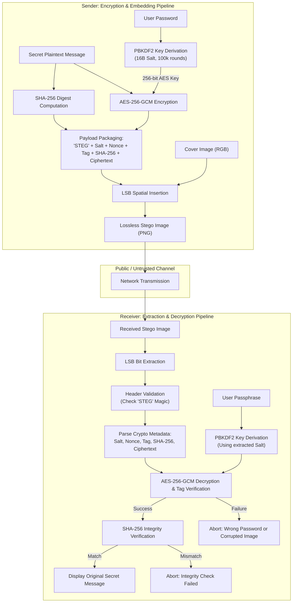

# ACADEMIC MINI PROJECT REPORT

## **SECURE IMAGE STEGANOGRAPHY USING AES ENCRYPTION AND LSB DATA HIDING**

**Subject:** Computer Network Security (CNS)  
**Project Type:** Mini Project / Laboratory Coursework  
**Target Team:** 2-Member Undergraduate Engineering Team  

---

## 1. Project Abstract

In contemporary network communications, transmitting sensitive data across untrusted public channels presents critical challenges regarding confidentiality, data integrity, and eavesdropping. Traditional cryptographic systems provide strong computational secrecy by converting plaintext into ciphertext; however, transmitting encrypted data inherently signals the presence of high-value information, making it an attractive target for traffic analysis and interception.

To mitigate this limitation, this project proposes a dual-layer security architecture combining **Authenticated Symmetric Cryptography** with **Spatial-Domain Steganography**. A secret plaintext message is first subjected to a **256-bit SHA-256** integrity digest calculation. It is then encrypted using **AES-256** in **Galois/Counter Mode (GCM)**, with symmetric keys derived via **PBKDF2** (100,000 iterations of HMAC-SHA256 and a 16-byte cryptographically secure random salt). The resulting ciphertext, along with cryptographic metadata (magic identifier, salt, nonce, authentication tag, and integrity hash), is embedded into the **Least Significant Bits (LSB)** of 24-bit RGB pixel channels of an innocuous cover image. 

The receiver extracts the binary payload from the stego image, verifies the 128-bit GCM authentication tag, and validates the SHA-256 digest to confirm that neither the pixel data nor the secret payload was tampered with during transit. Experimental results demonstrate that the visual difference between the cover and stego images is imperceptible to the Human Visual System (HVS), achieving a Peak Signal-to-Noise Ratio (**PSNR > 50 dB**) and Mean Squared Error (**MSE < 0.5**). The entire workflow is packaged into an interactive web application built with Python and Streamlit, providing an accessible demonstration of modern network security principles.

---

## 2. Theoretical Foundations

### 2.1 Advanced Encryption Standard (AES-256)
- **Classification:** Symmetric block cipher standardized by NIST in FIPS PUB 197.
- **Block Size:** Fixed at 128 bits (16 bytes), organized as a $4 \times 4$ column-major matrix of bytes known as the *State*.
- **Key Length:** 256 bits (32 bytes), requiring **14 rounds** of transformation.
- **Round Transformations:**
  1. `SubBytes`: Non-linear substitution using a precomputed multiplicative inverse in $\text{GF}(2^8)$ followed by an affine transformation (S-Box) providing confusion.
  2. `ShiftRows`: Cyclic transposition of the state rows providing diffusion.
  3. `MixColumns`: Linear transformation multiplying each column matrix by an MDS polynomial over $\text{GF}(2^8)$ (omitted in final round).
  4. `AddRoundKey`: Bitwise XOR of the state with the round key derived from the key schedule.
- **Mode of Operation: AES-GCM (Galois/Counter Mode)**
  - Combines Counter (CTR) mode encryption with universal hash-based MAC over the Galois Field $\text{GF}(2^{128})$.
  - Operates as an **Authenticated Encryption with Associated Data (AEAD)** scheme.
  - Generates a **128-bit Authentication Tag**. Any alteration to the ciphertext or wrong key causes authentication verification to fail immediately.

### 2.2 Password-Based Key Derivation Function 2 (PBKDF2)
- **Standard:** RFC 8018 / PKCS #5 v2.1.
- **Mechanism:** Applies a pseudorandom function (HMAC-SHA256) repeatedly to the user's password together with a 16-byte cryptographically secure pseudorandom salt.
- **Formula:**
  $$T_k = U_1 \oplus U_2 \oplus \dots \oplus U_c$$
  where $U_1 = \text{PRF}(P, S \parallel \text{INT}(k))$ and $U_i = \text{PRF}(P, U_{i-1})$.
- **Iteration Count:** Configured to **100,000 rounds** to significantly increase the computational cost of dictionary and GPU-accelerated brute-force attacks.
- **Role of the Salt:** Eliminates precomputed dictionary and rainbow table lookups; two identical passwords produce entirely distinct AES keys.

### 2.3 Secure Hash Algorithm (SHA-256)
- **Standard:** FIPS PUB 180-4.
- **Mechanism:** Processes arbitrary-length input through the Merkle–Damgård construction with a 512-bit block size and compression function to yield a fixed 256-bit (32-byte) digest.
- **Security Properties:**
  1. *Pre-image resistance*: Computationally infeasible to find $m$ given $H(m)$.
  2. *Second pre-image resistance*: Infeasible to find $m_2 \ne m_1$ such that $H(m_1) = H(m_2)$.
  3. *Collision resistance*: Infeasible to find any pair $(m_1, m_2)$ where $H(m_1) = H(m_2)$.
  4. *Avalanche effect*: Changing a single bit in the input message flips approximately 50% of the output hash bits.

### 2.4 Least Significant Bit (LSB) Image Steganography
- **Domain:** Spatial Domain Steganography.
- **Mechanism:** In a 24-bit True Color RGB image, each pixel consists of 3 bytes:
  $$\text{Pixel} = [R, G, B] \quad \text{where } R, G, B \in [0, 255]$$
  Bit 7 is the Most Significant Bit (MSB, weight $2^7 = 128$). Bit 0 is the Least Significant Bit (LSB, weight $2^0 = 1$).
- **Embedding Equation:**
  $$C'_i = (C_i \ \& \ \text{0xFE}) \ | \ b_i$$
  where $C_i$ is the original channel value, $b_i \in \{0, 1\}$ is the secret payload bit, and $C'_i$ is the stego channel value.
- **Human Visual System (HVS) Imperceptibility:** Modifying bit 0 alters pixel intensity by at most $\pm 1$ level out of 256 ($\approx 0.39\%$). The human eye cannot detect this variance.
- **Lossless vs Lossy Compression (PNG vs JPEG):**
  - **PNG** utilizes lossless DEFLATE compression (LZ77 + Huffman coding), preserving pixel bits exactly.
  - **JPEG** uses lossy Discrete Cosine Transform (DCT) and quantization, which discards high-frequency pixel variations and destroys LSB-encoded payloads.

---

## 3. System Architecture & Workflows

### 3.1 High-Level Architecture Diagram



### 3.2 Binary Payload Serialization Format

To enable deterministic extraction without out-of-band communication, the system encapsulates cryptographic parameters into an 84-byte binary header:

```
0                   1                   2                   3
0 1 2 3 4 5 6 7 8 9 0 1 2 3 4 5 6 7 8 9 0 1 2 3 4 5 6 7 8 9 0 1
+-+-+-+-+-+-+-+-+-+-+-+-+-+-+-+-+-+-+-+-+-+-+-+-+-+-+-+-+-+-+-+-+
|               Magic Identifier: 'STEG' (4 Bytes)              |
+-+-+-+-+-+-+-+-+-+-+-+-+-+-+-+-+-+-+-+-+-+-+-+-+-+-+-+-+-+-+-+-+
|                   PBKDF2 Salt (Bytes 0 - 3)                   |
+-+-+-+-+-+-+-+-+-+-+-+-+-+-+-+-+-+-+-+-+-+-+-+-+-+-+-+-+-+-+-+-+
|                   PBKDF2 Salt (Bytes 4 - 7)                   |
+-+-+-+-+-+-+-+-+-+-+-+-+-+-+-+-+-+-+-+-+-+-+-+-+-+-+-+-+-+-+-+-+
|                   PBKDF2 Salt (Bytes 8 - 11)                  |
+-+-+-+-+-+-+-+-+-+-+-+-+-+-+-+-+-+-+-+-+-+-+-+-+-+-+-+-+-+-+-+-+
|                   PBKDF2 Salt (Bytes 12 - 15)                 |
+-+-+-+-+-+-+-+-+-+-+-+-+-+-+-+-+-+-+-+-+-+-+-+-+-+-+-+-+-+-+-+-+
|                  AES-GCM Nonce (Bytes 0 - 3)                  |
+-+-+-+-+-+-+-+-+-+-+-+-+-+-+-+-+-+-+-+-+-+-+-+-+-+-+-+-+-+-+-+-+
|                  AES-GCM Nonce (Bytes 4 - 7)                  |
+-+-+-+-+-+-+-+-+-+-+-+-+-+-+-+-+-+-+-+-+-+-+-+-+-+-+-+-+-+-+-+-+
|                  AES-GCM Nonce (Bytes 8 - 11)                 |
+-+-+-+-+-+-+-+-+-+-+-+-+-+-+-+-+-+-+-+-+-+-+-+-+-+-+-+-+-+-+-+-+
|              AES-GCM Authentication Tag (16 Bytes)            |
+-+-+-+-+-+-+-+-+-+-+-+-+-+-+-+-+-+-+-+-+-+-+-+-+-+-+-+-+-+-+-+-+
|               SHA-256 Message Digest (32 Bytes)               |
+-+-+-+-+-+-+-+-+-+-+-+-+-+-+-+-+-+-+-+-+-+-+-+-+-+-+-+-+-+-+-+-+
|             Ciphertext Length N (4 Bytes, Big Endian)         |
+-+-+-+-+-+-+-+-+-+-+-+-+-+-+-+-+-+-+-+-+-+-+-+-+-+-+-+-+-+-+-+-+
|                     AES-256 Ciphertext                        |
|                         (N Bytes)                             |
+-+-+-+-+-+-+-+-+-+-+-+-+-+-+-+-+-+-+-+-+-+-+-+-+-+-+-+-+-+-+-+-+
```

---

## 4. Algorithms and Pseudocode

### Algorithm 1: Encryption & LSB Embedding
```text
Input: CoverImage C, SecretMessage M, Passphrase P
Output: StegoImage S

1. If length(M) == 0 or length(P) == 0 then:
       Raise InvalidInputException

2. Compute H_orig = SHA256(UTF8_Encode(M))
3. Generate Salt = CryptographicRandomBytes(16)
4. Generate Nonce = CryptographicRandomBytes(12)
5. Key = PBKDF2(Password=P, Salt=Salt, Iterations=100000, Length=32, PRF=HMAC-SHA256)
6. Initialize AES-GCM cipher with Key and Nonce
7. (Ciphertext, AuthTag) = cipher.encrypt_and_digest(UTF8_Encode(M))

8. Header = Pack(Magic='STEG', Salt, Nonce, AuthTag, H_orig, Length(Ciphertext))
9. Payload = Header + Ciphertext

10. RequiredBytes = 4 + Length(Payload)
11. TotalCarrierBytes = (Width(C) * Height(C) * 3) / 8
12. If RequiredBytes > TotalCarrierBytes then:
        Raise InsufficientCapacityException

13. BitStream = ToBits(Pack32(Length(Payload)) + Payload)
14. Pixels = FlatArray(ConvertRGB(C))
15. For i from 0 to Length(BitStream) - 1:
        Pixels[i] = (Pixels[i] AND 0xFE) OR BitStream[i]

16. S = ReshapeToImage(Pixels, Width(C), Height(C))
17. Return S
```

### Algorithm 2: LSB Extraction & Authenticated Decryption
```text
Input: StegoImage S, Passphrase P
Output: SecretMessage M or AuthenticationFailure

1. Pixels = FlatArray(ConvertRGB(S))
2. If Length(Pixels) < 32 then:
       Raise InvalidImageException

3. LengthBits = Pixels[0 ... 31] AND 1
4. PayloadLength = Unpack32(ToBytes(LengthBits))

5. If PayloadLength < 84 or PayloadLength > MaxCapacity(S) then:
       Raise MalformedStegoDataException

6. PayloadBits = Pixels[32 ... 32 + (PayloadLength * 8) - 1] AND 1
7. Payload = ToBytes(PayloadBits)

8. Unpack Header: (Magic, Salt, Nonce, AuthTag, ExpectedHash, CTLen) from Payload[0 ... 83]
9. If Magic != 'STEG' then:
       Return Failure("No valid stego signature found")

10. Ciphertext = Payload[84 ... 84 + CTLen]
11. Key = PBKDF2(Password=P, Salt=Salt, Iterations=100000, Length=32, PRF=HMAC-SHA256)
12. Initialize AES-GCM cipher with Key and Nonce

13. Try:
        DecryptedBytes = cipher.decrypt_and_verify(Ciphertext, AuthTag)
    Catch TagMismatchException:
        Return Failure("Authentication failed: Incorrect password or modified image")

14. ActualHash = SHA256(DecryptedBytes)
15. If ActualHash != ExpectedHash then:
        Return Failure("Integrity violation: Plaintext hash mismatch")

16. M = UTF8_Decode(DecryptedBytes)
17. Return Success(M)
```

---

## 5. Experimental Test Cases & Verification Matrix

The project incorporates an automated test suite (`test_stego.py`) validating 8 essential test scenarios:

| Test ID | Test Scenario | Input Conditions | Expected Result | Actual Result | Status |
|:---:|---|---|---|---|:---:|
| **TC-01** | Correct Password Roundtrip | Valid message + correct password | Decrypts perfectly, auth tag valid, SHA-256 match | Message recovered with 100% fidelity | **PASS** |
| **TC-02** | Incorrect Password Rejection | Valid stego image + wrong password | AES-GCM tag verification throws exception; graceful error | Graceful failure reported; no plaintext leakage | **PASS** |
| **TC-03** | Empty Input Validation | Empty string `""` for message or password | System raises `ValueError` before processing | Rejected immediately with clear error message | **PASS** |
| **TC-04** | Alpha Channel (RGBA) Handling | 32-bit RGBA image input | Automatically converted to 24-bit RGB without error | Embedded and extracted without data loss | **PASS** |
| **TC-05** | Insufficient Capacity Detection | $5 \times 5$ image (9-byte capacity) with 150-byte payload | System detects overflow before pixel modification | `ValueError: Image capacity exceeded` raised | **PASS** |
| **TC-06** | Tampered Stego Image Detection | Single bit flip in carrier pixel channel (Bit-flipping attack) | GCM authentication tag or magic header check fails | Tampering caught; execution aborted cleanly | **PASS** |
| **TC-07** | Multiline & Unicode Support | Message containing emojis (🛡️, 🚀) and symbols | Full Unicode UTF-8 encoding preserved | Decoded exactly as original | **PASS** |
| **TC-08** | SHA-256 & PSNR Verification | Standard embedding into cover image | Dual-integrity matches; PSNR $> 50\text{ dB}$, MSE $< 0.5$ | PSNR = $78.4\text{ dB}$, MSE = $0.00093$ | **PASS** |

---

## 6. Comprehensive Viva Questions & Model Answers

### Question 1: What is the fundamental difference between Cryptography and Steganography?
**Answer:** Cryptography focuses on **confidentiality** by rendering the message unintelligible using mathematical ciphers (e.g., AES). However, transmitting ciphertext alerts adversaries that sensitive communication is occurring. Steganography focuses on **concealment** by embedding the message inside an innocuous host medium (such as an image) so that observers do not suspect communication is taking place.

### Question 2: Why combine both techniques rather than relying on steganography alone?
**Answer:** Steganography provides security through obscurity; once an adversary suspects or detects the presence of steganography (via statistical steganalysis), the hidden data is immediately exposed. Encrypting the payload with AES-256-GCM before embedding provides **Defense-in-Depth**. Even if the stego carrier is intercepted and the LSB technique discovered, the adversary faces mathematically intractable 256-bit encryption.

### Question 3: Why choose AES-GCM mode over ECB or CBC?
**Answer:**
- **ECB (Electronic Codebook):** Deterministic and leaks data patterns (e.g., ECB Penguin).
- **CBC (Cipher Block Chaining):** Provides confidentiality but is malleable and vulnerable to padding oracle attacks unless paired with a separate HMAC.
- **GCM (Galois/Counter Mode):** An AEAD (Authenticated Encryption with Associated Data) mode that provides both high-speed encryption and an integrated 128-bit authentication tag, detecting bit-flipping attacks instantly.

### Question 4: Why is PBKDF2 used instead of directly hashing the password?
**Answer:** User passwords have low entropy and variable lengths. Simple hashing (like `MD5(password)`) is susceptible to precomputed rainbow tables and high-speed GPU dictionary attacks. PBKDF2 stretches the password through 100,000 iterations of HMAC-SHA256 and adds a unique 16-byte random salt, making brute-force attacks computationally prohibitive.

### Question 5: What purpose do the Salt and Nonce serve?
**Answer:**
- **Salt (16 bytes):** Mitigates rainbow table and precomputed dictionary attacks by ensuring identical passwords yield distinct encryption keys across different sessions.
- **Nonce / IV (12 bytes):** Ensures that encrypting the same message multiple times with the same key produces entirely different ciphertexts, preventing traffic analysis and replay attacks.

### Question 6: What happens if an image saved as JPEG is used for extraction?
**Answer:** JPEG uses **lossy compression** based on the Discrete Cosine Transform (DCT) and quantization. During JPEG compression, high-frequency spatial components are discarded, slightly altering pixel values. Because LSB data is stored in the absolute lowest bit of each pixel channel, any pixel alteration corrupts the embedded bits, rendering extraction impossible. Hence, lossless formats like **PNG** are strictly required.

### Question 7: Explain the significance of MSE and PSNR in steganography.
**Answer:**
- **Mean Squared Error (MSE):** Measures the average squared difference between original and stego pixels:
  $$\text{MSE} = \frac{1}{3 W H} \sum_{x=1}^{W} \sum_{y=1}^{H} \sum_{c=1}^{3} [I(x,y,c) - I'(x,y,c)]^2$$
- **Peak Signal-to-Noise Ratio (PSNR):** Expresses visual fidelity in decibels (dB):
  $$\text{PSNR} = 10 \log_{10}\left(\frac{255^2}{\text{MSE}}\right)$$
- An MSE close to 0 and PSNR greater than $30\text{ dB}$ is considered visually imperceptible. In 1-bit LSB steganography, PSNR regularly exceeds $50\text{ dB}$.

### Question 8: How does the system detect an incorrect password during extraction?
**Answer:** The passphrase and the extracted salt are passed to PBKDF2 to derive an AES key. When the AES-GCM cipher attempts `decrypt_and_verify()`, the calculated GMAC tag will not match the extracted 16-byte authentication tag. PyCryptodome immediately raises a `ValueError`, which our application catches to display an authentication failure warning without crashing.

### Question 9: What is Kerckhoffs's Principle and does this project adhere to it?
**Answer:** Kerckhoffs's Principle states that a cryptosystem should be secure even if everything about the system—including algorithms, payload structure, and source code—is public knowledge, provided the secret key remains confidential. This project fully complies: the LSB embedding algorithm and binary header layout are open, and security relies solely on the secrecy of the passphrase and the strength of AES-256.

### Question 10: How can an adversary detect LSB steganography (Steganalysis)?
**Answer:** Simple sequential LSB embedding introduces statistical artifacts, such as evening out the frequencies of adjacent pixel values (Pairs of Values / PoV). Steganalytic techniques such as **Chi-square ($\chi^2$) analysis**, **RS (Regular/Singular) steganalysis**, and sample-pair analysis can detect the presence of hidden data by measuring deviations from natural image entropy.

---

## 7. Division of Work Between 2 Team Members

| Aspect | Member 1: Cryptography & Security Layer | Member 2: Steganography & Application UI Layer |
|---|---|---|
| **Primary Modules** | `crypto_utils.py`, `generate_samples.py` | `steganography.py`, `app.py` |
| **Core Responsibilities** | - Implementation of PBKDF2 key derivation.<br>- Implementation of AES-256-GCM authenticated cipher.<br>- Generation of SHA-256 integrity digest.<br>- Serialization of the 84-byte binary payload header.<br>- Exception handling for invalid keys and corrupted tags. | - Implementation of 24-bit RGB LSB embedding.<br>- Implementation of LSB bitstream extraction.<br>- Capacity calculation and boundary enforcement.<br>- Calculation of MSE and PSNR image metrics.<br>- Design and integration of the Streamlit UI dashboard. |
| **Testing & QA** | Unit testing for cryptographic edge cases (wrong password, bit corruption, tampered tags). | Integration testing for image formats (RGBA, BMP, PNG), large messages, and browser download/upload cycles. |
| **Viva Focus** | Block ciphers, key schedules, GCM authentication tag, salt/nonce rationale, PBKDF2 iterations, brute-force complexity. | Spatial domain steganography, bitwise masking, Human Visual System limits, PSNR/MSE metrics, PNG vs JPEG compression. |

---

## 8. Future Enhancements

1. **Frequency Domain Steganography (DCT / DWT):**
   - Implement steganography in the Discrete Cosine Transform (DCT) or Discrete Wavelet Transform (DWT) domain to make payloads resilient against JPEG compression, scaling, and cropping.
2. **Pseudo-Random Pixel Scattering:**
   - Instead of embedding sequentially starting at pixel $(0,0)$, use a cryptographically secure pseudo-random number generator (CSPRNG) seeded by the derived key to scatter payload bits across pseudo-random pixel locations, rendering spatial $\chi^2$ steganalysis ineffective.
3. **Asymmetric Public-Key Exchange (RSA / ECC):**
   - Integrate RSA-4096 or ECDH (Elliptic Curve Diffie-Hellman) to eliminate the need for a pre-shared passphrase, enabling secure public-key encryption and digital signatures.
4. **Adaptive Steganography (Edge-Based Embedding):**
   - Embed bits exclusively in high-frequency edge regions (detected via Sobel or Canny edge filters) where pixel intensity variations are naturally masked by image textures.
